# Classification-Models-for-Predicting-Default-Risk-in-Alteryx

## Creditworthiness

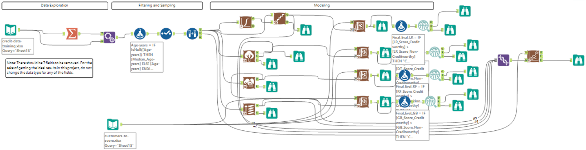

### Step 1: Business and Data Understanding

#### What decisions needs to be made?

The main target is to forecast the person is worthy of the credit being granted, how much is the risk involved given his personal traits/variables as per his historical records.

#### What data is needed to inform those decisions?

Historical data (including his age/status/previous records etc) was needed to forecast the best possible outcome either he/she will return the loan or not.

#### What kind of model (Continuous, Binary, Non-Binary, Time-Series) do we need to use to help make these decisions?

Since we are trying to forecast either an individual is worthy or not, so it clearly states a Binary problem, hence we need to use a binary model for this.

### Step 2: Building the Training Set

1. For numerical data fields, the correlation should be at least .70 to be considered “high”.
2. Fields with a lot of missing data should be removed.
3. Are there only a few values in a subset of your data field? Does the data field look very uniform (there is only one value for the entire field?). This is called “low variability” and you should remove fields that have low variability. Refer to the "Tips" section to find examples of data fields with low-variability.
4. Your clean data set should have 13 columns where the Average of Age Years should be 36 (rounded up)

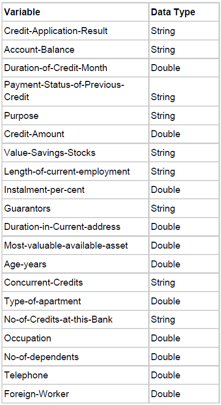

#### In your cleanup process, which fields did you remove or impute?

1. "Duration-in-Current-address" was removed because almost 70% of the data was missing.
2. "Age-years" had almost 2% of the missing data that was imputed by taking the Median value of the entire variable.

Below are the images to verify the above mentioned points.

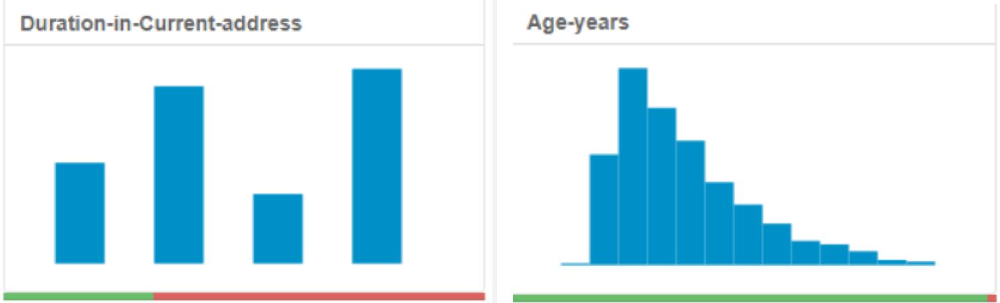

3. Moreover, 6 other variables been removed that would have impacted the biasness in the model because of very low to no variance, e.g., single observation in Concurrent-Credit, Occupation, Guarantors, No-of-dependents, Telephone, and Foreign Worker.

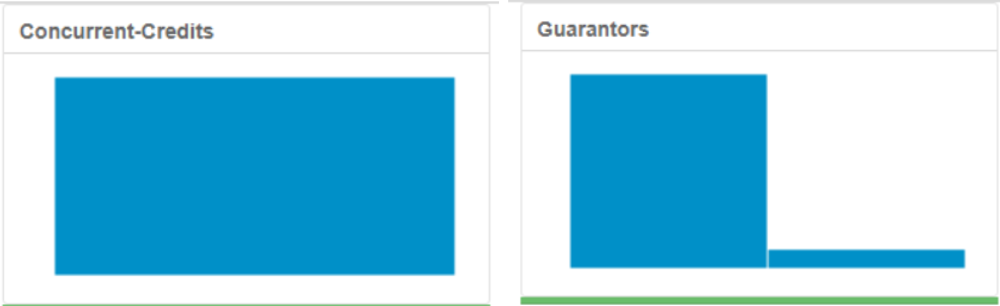
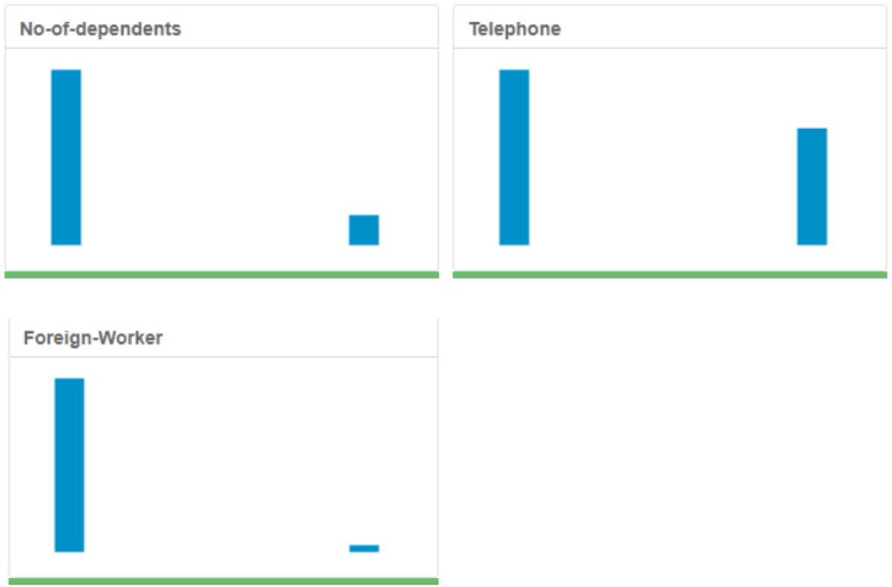

### Step 3: Train your Classification Models

70% of the dataset is for estimation and the 30% is reserved for the validation and the random seed is set to 1.

We will be building 4 models in Alteryx:
a) Logistic Regression
b) Decision Tree
c) Forest Model
d) Boosted Model

#### Which predictor variables are significant or the most important? Please show the p-values or variable importance charts for all of your predictor variables.

First we build all the four models using all of the 13 predictor variables. And after comparison, models provides us the p-values and the variable importance charts as below:

#### Logistic Regression

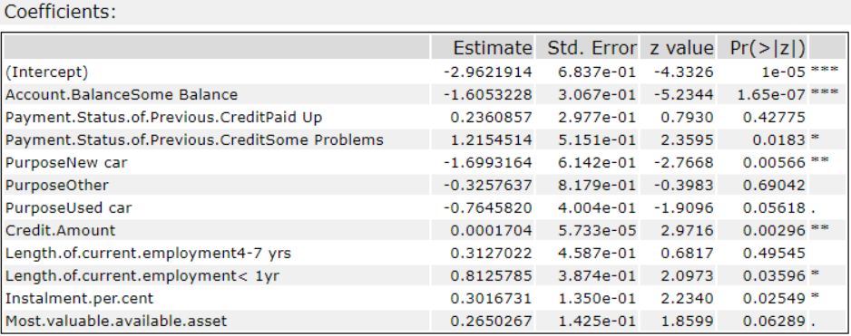

#### Decision Tree

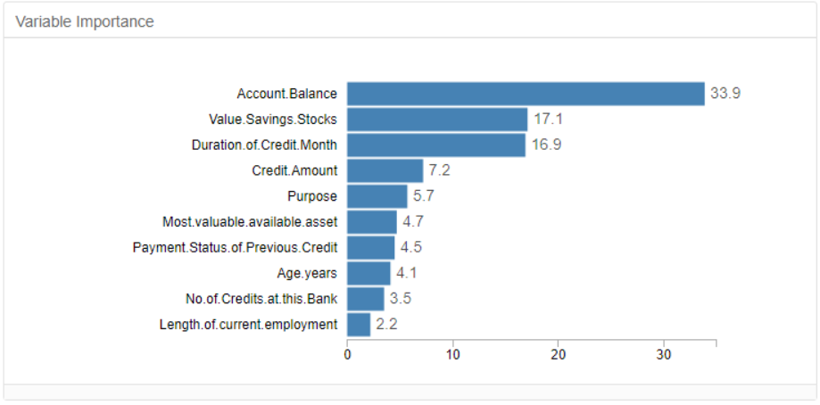

#### Random Forest

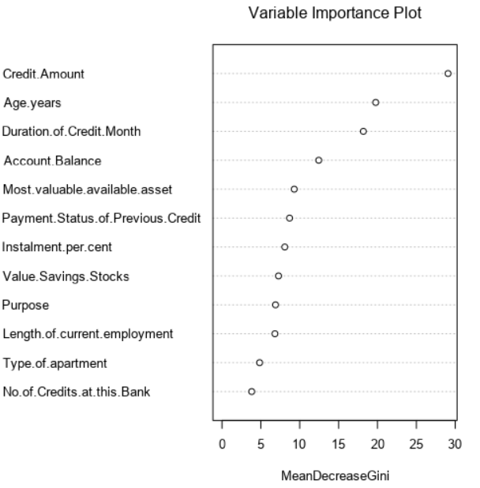

#### Boosted Model

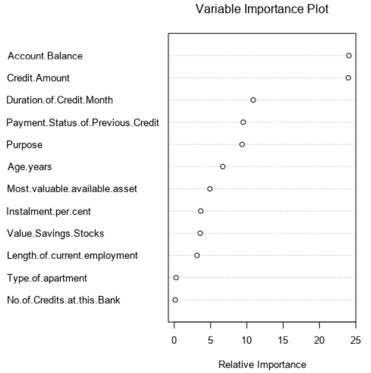

#### Note

For making improvements, we selected some of the predictor variables for each model separately and made the comparison again.

For justification, below images are presented with the p-values and the variable importance charts:

#### Logistic Regression

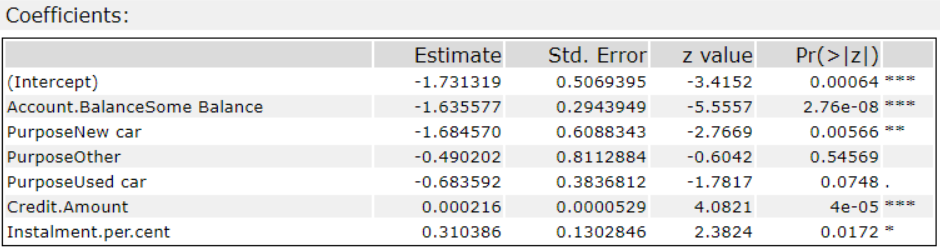

#### Decision Tree

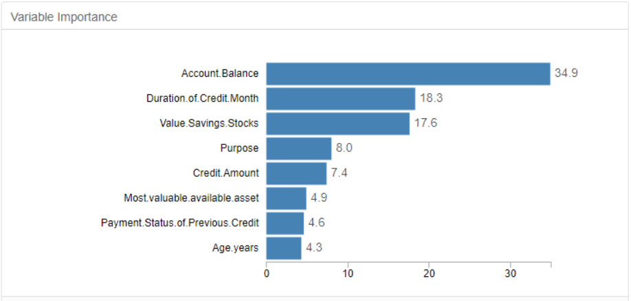

#### Random Forest

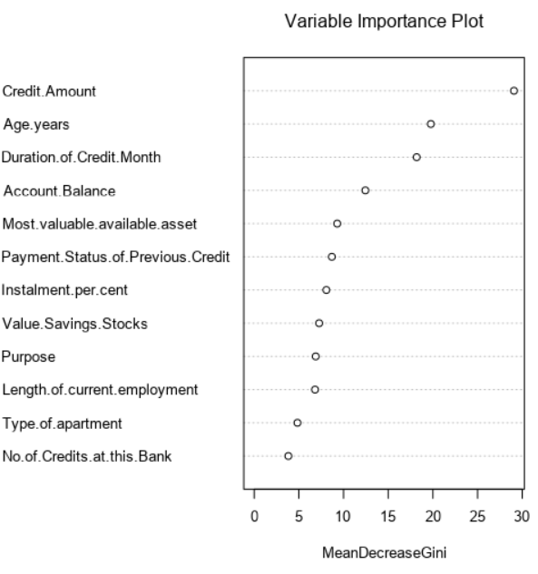

#### Boosted Model

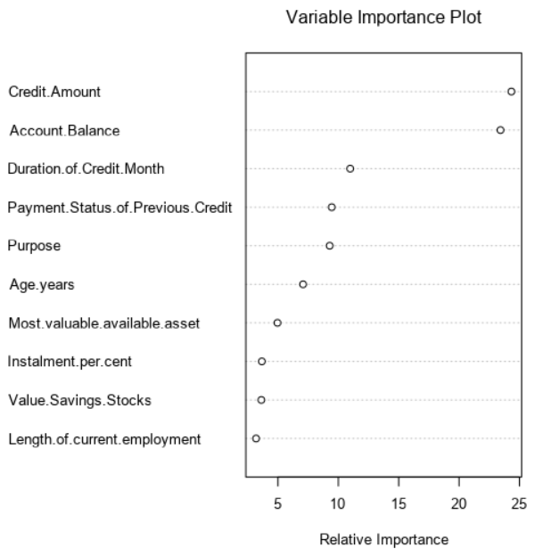

#### Validate your model against the Validation set. What was the overall percent accuracy? Show the confusion matrix. Are there any bias seen in the model’s predictions?

1. Overall accuracy of all the chosen model (i.e. Random Forest Model) is 80% with the highest F1 score and the highest accuracy for Creditworthy. Whereas, the accuracy for Non-creditworthy shows the model is biased towards Creditworthy.
2. Boosted Models has the overall accuracy of 79% and also biased towards Creditworthy accuracy.
3. Decision Tree model has almost 75% of overall accuracy but the least accuracy for Creditworthy and the highest accuracy for Non-Creditworthy as compared to other 3 models. The model is still biased towards Creditworthy though.
4. Logistic Regression model has the least accuracy of almost 73% among other models and also biased towards the Creditworthy.

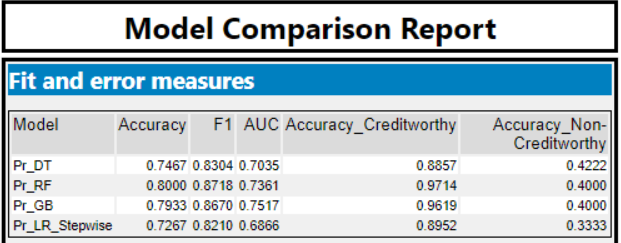
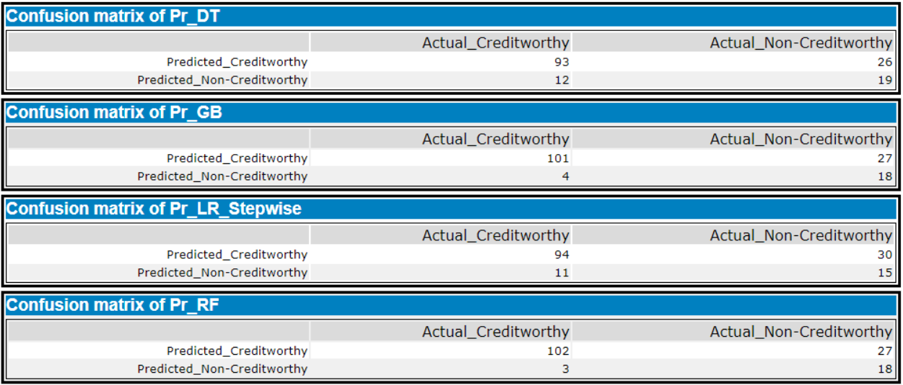

### Analysis

Decide on the best model and score your new customers. For reviewing consistency, if Score_Creditworthy is greater than Score_NonCreditworthy, the person should be labeled as “Creditworthy”.

#### How you came up with your classification model and write down how many of the new customers would qualify for a loan.

1. After the comparison between the four models, it appears that the “Random Forest” performs better than others with 80% overall accuracy.
2. 409 customers will be qualified out of 500 for a loan based on score of the Creditworthy that is greater than Non-creditworthy.

#### Which model did you choose to use? Please justify your decision using all of the following techniques. Please only use these techniques to justify your decision:

1. We chose Random Forest model with higher accuracy.
2. Overall accuracy is 80% against validation set.
3. Accuracy for Creditworthy is 97% and for Non-Creditworthy is 40%.
4. ROC curve depicts the accuracy and measurement of the model by ploting true positives and false negatives. The higher the ROC curve is the better,

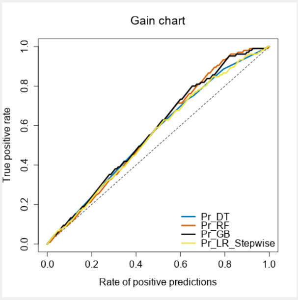

5. In the confusion matrix, it’s biased towards Creditworthy.

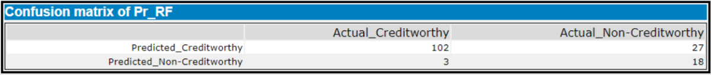

#### How many individuals are creditworthy?

409 out of 500 are creditworthy and 91 are not.